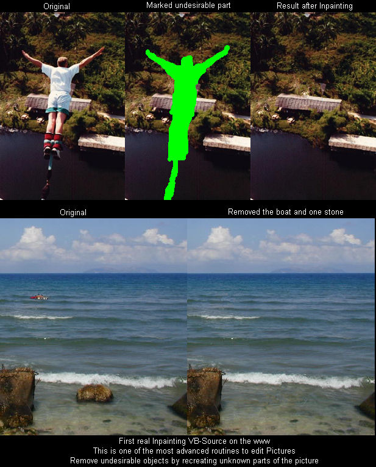



## A Real Inpainter \(Faster Version\)

### Description

One of the most advanced routines in picture editing. Remove undesirable parts from pictures. With this routine the picture looks like the removed part was never there like you can see on the screenshot. Please leave comments and if you like it then vote :-) Update: Fixed some errors and updated the gui
 
### More Info
 

             |
---                |---
**Submitted On**   |2009-01-11 18:47:42
**By**             |[Scythe](https://github.com/Planet-Source-Code/PSCIndex/blob/master/ByAuthor/scythe.md)
**Level**          |Advanced
**User Rating**    |5.0 (139 globes from 28 users)
**Compatibility**  |VB 5\.0, VB 6\.0
**Category**       |[Graphics](https://github.com/Planet-Source-Code/PSCIndex/blob/master/ByCategory/graphics__1-46.md)
**World**          |[Visual Basic](https://github.com/Planet-Source-Code/PSCIndex/blob/master/ByWorld/visual-basic.md)
**Archive File**   |[A\_Real\_Inp2140301122009\.zip](https://github.com/Planet-Source-Code/scythe-a-real-inpainter-faster-version__1-71589/archive/master.zip)

